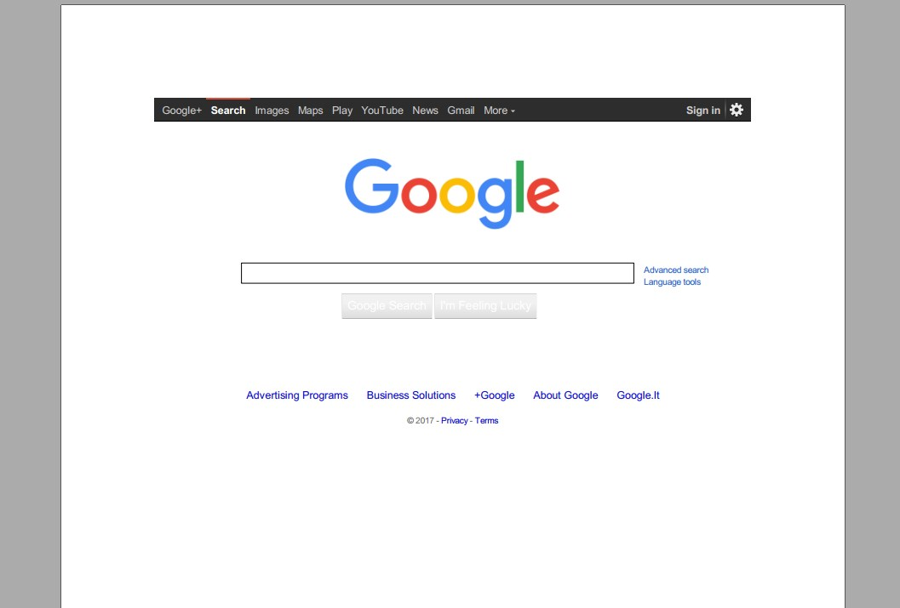
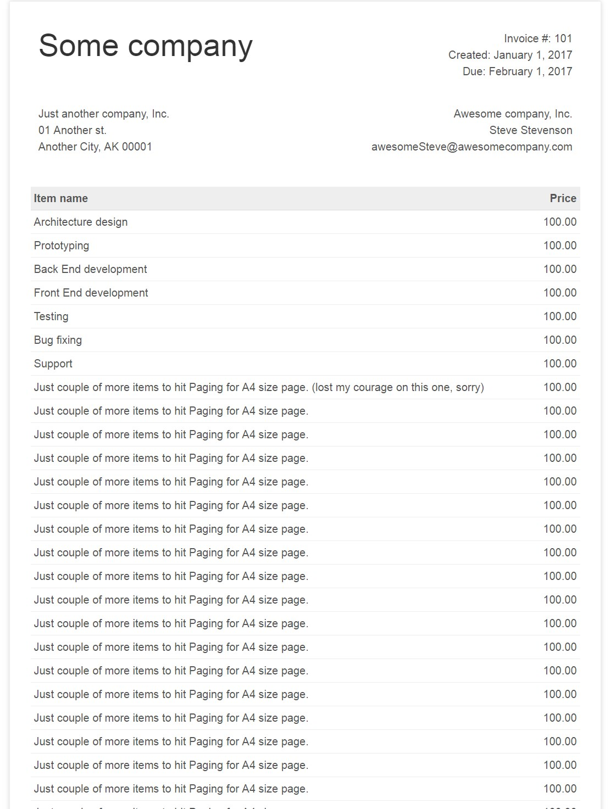
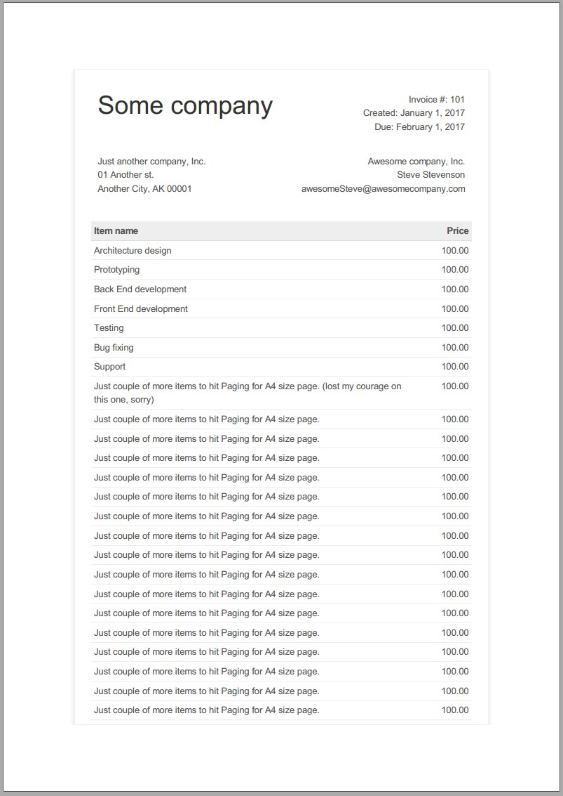
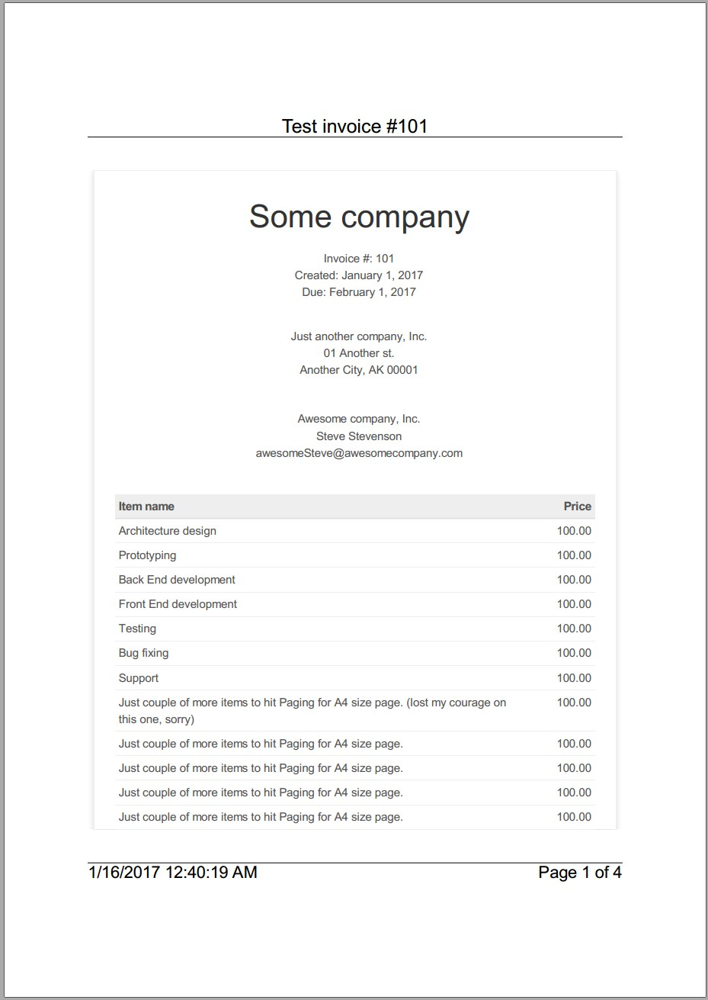
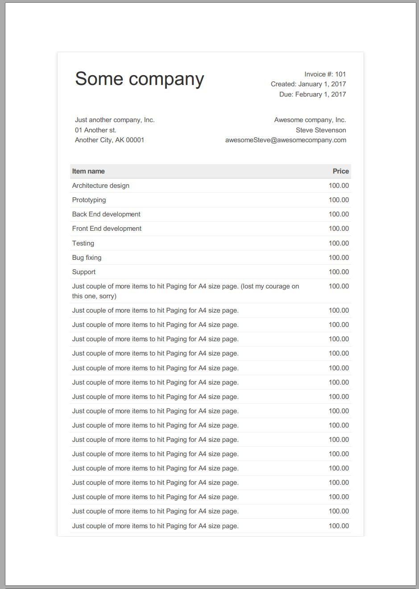
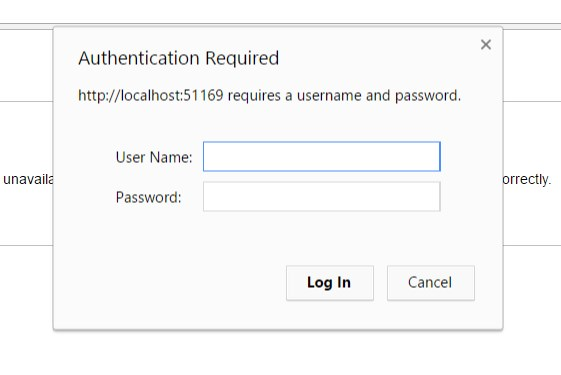
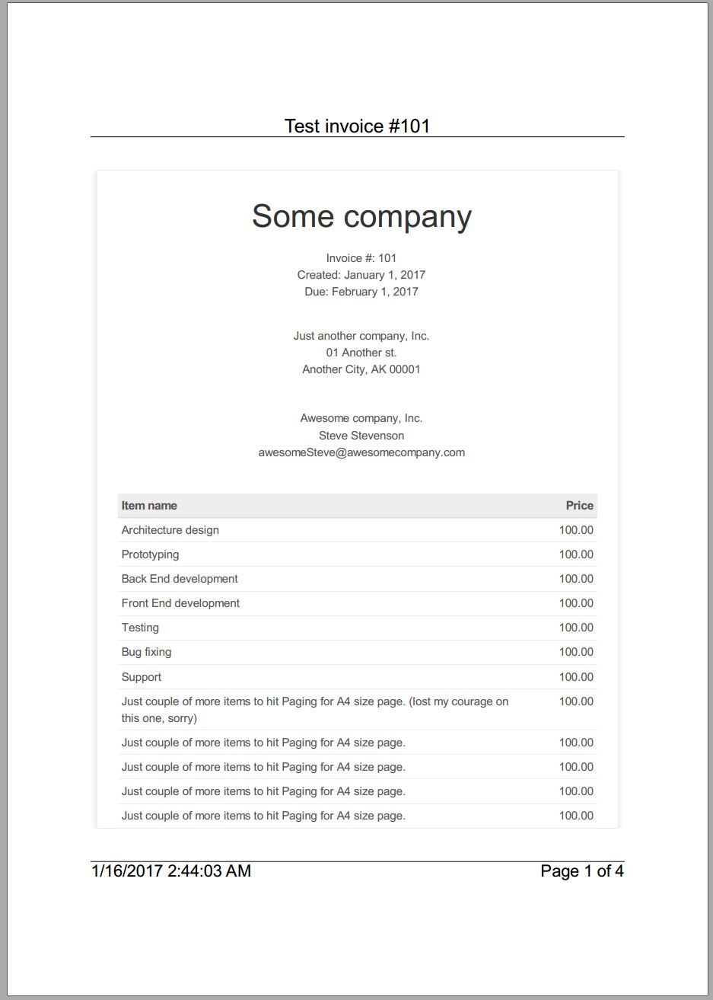
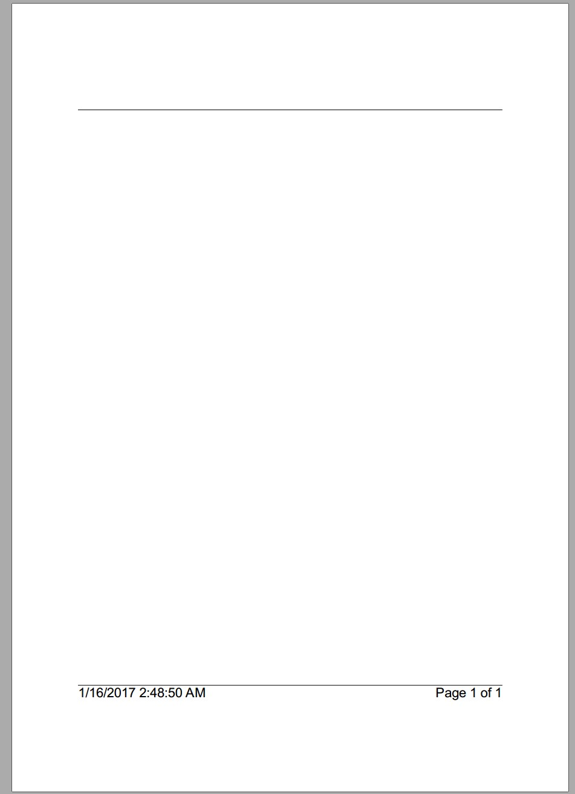

##Intro
This demo walks you through examples on how to use IronPdf. Please feel free to request any additional use case demos.

Demo consists of Hello World, RenderHtmlAsPdf and RednerUrlAsPdf examples. All the examples could be found under corresponding projects under IronPDFDemo solution.
##Installation
You can install IronPdf either via NuGet. The package name is [IronPDF](https://www.nuget.org/packages/IronPdf/).
Or
You can use [direct link to download the library](http://ironpdf.com/packages/IronPdf.zip).
##Hello World
Once you have IronPdf installed and referenced in you project you can start using it right away by typing couple of strings:
```C#
var htmlToPdf = new HtmlToPdf();  // new instance of HtmlToPdf
```
then if you need to turn html into pdf
```C#
// html to turn into pdf
var html = @"<h1>Hello World!</h1><br><p>This is IronPdf.</p>";  

// turn html to pdf
var pdf = htmlToPdf.RenderHtmlAsPdf(html); 

// save resulting pdf into file
pdf.SaveAs(Path.Combine(Directory.GetCurrentDirectory(), "HtmlToPdf.Pdf"));  
```
or if you want to turn web page into pdf
```C#
// uri of the page to turn into pdf
var uri = new Uri("http://www.google.com/ncr");

// turn page into pdf
pdf = htmlToPdf.RenderUrlAsPdf(uri);

// save resulting pdf into file
pdf.SaveAs(Path.Combine(Directory.GetCurrentDirectory(), "UrlToPdf.Pdf"));
```
and that is it!

Corresponding results are:




Please find code sample under IronPDFDemo.HelloWorld project. 
##RenderHtmlAsPdf
####Example 1
Let us get into more real life example. Let us imagine that we have an Invoice in form of html that we need to turn into pdf. Here is how we do that.

>**Note:** You can find invoice html under IronPDFDemo.DemoWebSite project (~/Static/TestInvoice1.html). Please note that invoice has custom css for "print" media type.

Source invoice  looks like that in browser:



To turn it into pdf we are using almost the same code as for HelloWorld example, the difference is that we are reading html from file:
```C#
// read html from file
var html = File.ReadAllText(Path.Combine(Directory.GetCurrentDirectory(), "TestInvoice1.html"));

var htmlToPdf = new HtmlToPdf();
var pdf = htmlToPdf.RenderHtmlAsPdf(html);
pdf.SaveAs(Path.Combine(Directory.GetCurrentDirectory(), "HtmlToPdfExample1.Pdf"));
```
Result is:



looks great! Please find code sample under IronPDFDemo.RenderHtmlAdPdfDemo project. 
####Example 2
Now let us imagine that we need to bring some customization into the resulting pdf from Example 1. For example: add custom margins, add header with document title, footer with creation date and pages, and hit custom css for "print" media type that our invoice has. To do that we specify instance of PdfPrintOptions that we pass into HtmlToPdf constructor.

```C#
var pdfPrintOptions= new PdfPrintOptions()
{
    MarginTop = 50,
    MarginBottom = 50,
    Header = new PdfPrintOptions.PdfHeaderFooter()
    {
        CenterText = "{pdf-title}",
        DrawDividerLine = true,
        FontSize = 16
    },
    Footer = new PdfPrintOptions.PdfHeaderFooter()
    {
        LeftText = "{date} {time}",
        RightText = "Page {page} of {total-pages}",
        DrawDividerLine = true,
        FontSize = 14
    },
    CssMediaType = PdfPrintOptions.PdfCssMediaType.Print
};

var htmlToPdf = new HtmlToPdf(pdfPrintOptions);
```
>**Tip:** Instead of passing options as a parameter for constructor, you can set corresponding field for HtmlToPdf instance:
>```C#
>var htmlToPdf = new HtmlToPdf();
>htmlToPdf.PrintOptions = pdfPrintOptions;
>```

>**Note:** Header and footer features mail merge functionality, meaning that all the available merge fields ({page}, {total-pages}, {url}, {date}, {time}, {html-title}, {pdf-title}) if used will be populated with corresponding data.

The rest of the code is the same as for Example 1. Result is :



custom margins, header, footer, custom css for "print" media type -- everything is in place. Please find code sample under IronPDFDemo.RenderHtmlAdPdfDemo project. 
##RenderUrlAsPdf

####Set up
To run samples from this section you need to host IronPDFDemo.DemoWebSite locally. To do that under your IIS Express:
 1. Navigate to DemoWebSite 
 2. Right click -> Set as StartUp Project
 3. Start without debugging (Ctrl+F5)
 4. Navigate to your {baseurl}/Static/TestInvoice1.html to make sure it is working. In our case url is http://localhost:51169/Static/TestInvoice1.html (will be the same for you if you do not change corresponding project settings).
 
####Example 1
Now let us imaging that that we need to turn into pdf our invoice hosted under DemoWebSite web site. To do that we are using almost the same code as for HelloWorld example, the difference is that we are using different url:
```C#
var uri = new Uri("http://localhost:51169/Static/TestInvoice1.html");

var urlToPdf = new HtmlToPdf();
var pdf = urlToPdf.RenderUrlAsPdf(uri);
pdf.SaveAs(Path.Combine(Directory.GetCurrentDirectory(), "UrlToPdfExample1.Pdf"));
```
Result is:



great, looks as expected. Please find code sample under IronPDFDemo.RenderUrlAsPdfDemo project. 
####Example 2
Now let us imagine that we have our invoice hidden behind simple basic user authentication, and we need to turn it into pdf with some customization: add custom margins, add header with document title, footer with creation date and pages, and hit custom css for "print" media type that our invoice has. The url for invoice is http://localhost:51169/Invoice.

Accessing http://localhost:51169/Invoice results in "Authentication required" form:



>**Note:** Credentials are "testUser"/"testPassword".

So how do we bypass that? By means of setting HttpLoginCredentials:
```C#
var uri = new Uri("http://localhost:51169/Invoice");

var urlToPdf = new HtmlToPdf
{
    PrintOptions = new PdfPrintOptions()
    {
        MarginTop = 50,
        MarginBottom = 50,
        Header = new PdfPrintOptions.PdfHeaderFooter()
        {
            CenterText = "{pdf-title}",
            DrawDividerLine = true,
            FontSize = 16
        },
        Footer = new PdfPrintOptions.PdfHeaderFooter()
        {
            LeftText = "{date} {time}",
            RightText = "Page {page} of {total-pages}",
            DrawDividerLine = true,
            FontSize = 14
        },
        CssMediaType = PdfPrintOptions.PdfCssMediaType.Print
    },
    // setting login credentials to bypass basic authentication
    LoginCredentials = new HttpLoginCredentials()
    {
        NetworkUsername = "testUser",
        NetworkPassword = "testPassword"
    }
};

var pdf = urlToPdf.RenderUrlAsPdf(uri);
pdf.SaveAs(Path.Combine(Directory.GetCurrentDirectory(), "UrlToPdfExample2.Pdf"));
```
>**Note:** We are using the same customization as for HtmlToPdf Example2.

Result is:



everything is in place. Please find code sample under IronPDFDemo.RenderUrlAsPdfDemo project.  If you are wondering how the result would look like without HttpLoginCredentials, here you are:


